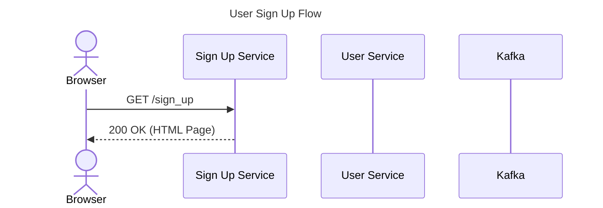

# Test 3

## Synchornous Calls
`->>` Request

`-->>` Response

```mermaid
---
title: User Sign Up Flow
---
sequenceDiagram
    actor Browser
    participant SUS as Sign Up Service
    participant US as User Service
    participant Kafka

    Browser->>SUS: GET /sign_up
    SUS-->>Browser: 200 OK (HTML Page)
```
