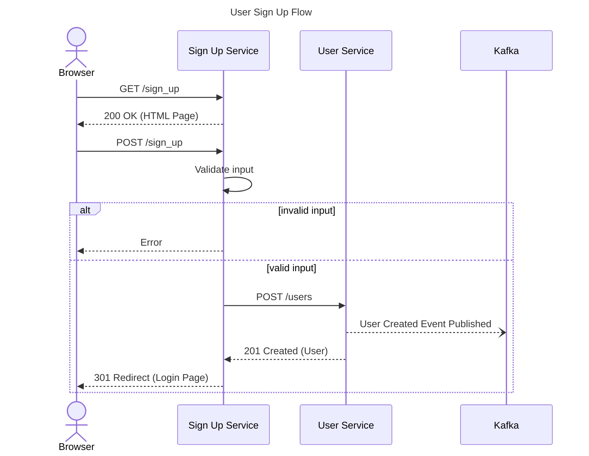

# Section 2

## Synchornous Calls
`->>` Request

`-->>` Response

## Asynchornous Calls
`--)` Request

```mermaid
---
title: User Sign Up Flow
---
sequenceDiagram
    actor Browser
    participant SUS as Sign Up Service
    participant US as User Service
    participant Kafka

    Browser->>SUS: GET /sign_up
    SUS-->>Browser: 200 OK (HTML Page)

    Browser->>SUS: POST /sign_up
    SUS->>SUS: Validate input

    alt invalid input
        SUS-->>Browser: Error
    else valid input
        SUS->>US: POST /users
        US--)Kafka: User Created Event Published
        US-->>SUS: 201 Created (User)
        SUS-->>Browser: 301 Redirect (Login Page)
    end
```
